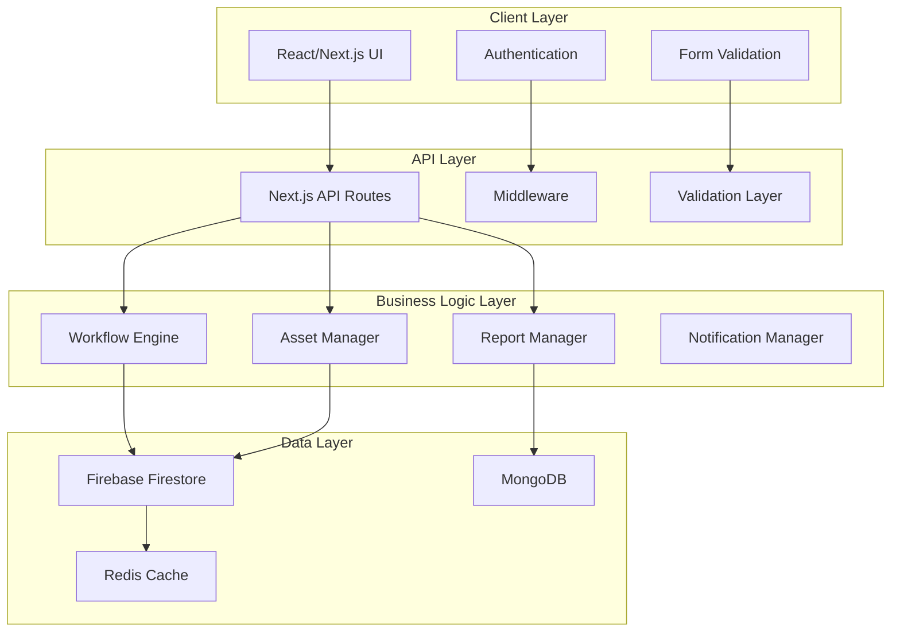

# KTI Assets System Integration - Design Document

## Overview

This design document outlines the architecture and implementation approach for making the KTI Assets system completely workable with integrated logic and database functionality. The system will be built on the existing Next.js foundation with comprehensive database integration, business logic implementation, and full feature testing.

## Architecture

### System Architecture Diagram



### Database Design

#### Primary Collections (Firebase Firestore)

1. **users**
   - Authentication and profile data
   - Role-based access control
   - Department assignments

2. **assets**
   - Complete asset master data
   - Lifecycle tracking
   - Attachment references

3. **assetMovements**
   - Movement history
   - Transfer records
   - Audit trails

4. **workflows**
   - Request workflows
   - Approval processes
   - Status tracking

5. **masterData**
   - Reference data
   - Configuration settings
   - Dropdown values

#### Secondary Storage (MongoDB)

- Backup and analytics data
- Historical reporting
- Bulk data operations

## Components and Interfaces

### 1. Database Service Layer

#### Firebase Service (`src/lib/firebase-service.ts`)
```typescript
interface FirebaseService {
  // Asset operations
  createAsset(asset: AssetData): Promise<string>
  updateAsset(id: string, updates: Partial<AssetData>): Promise<void>
  getAssets(filters?: AssetFilters): Promise<AssetData[]>
  deleteAsset(id: string): Promise<void>
  
  // Workflow operations
  createWorkflow(workflow: WorkflowData): Promise<string>
  updateWorkflowStep(id: string, step: WorkflowStep): Promise<void>
  getWorkflows(filters?: WorkflowFilters): Promise<WorkflowData[]>
  
  // User operations
  createUser(user: UserData): Promise<string>
  updateUser(id: string, updates: Partial<UserData>): Promise<void>
  getUsers(filters?: UserFilters): Promise<UserData[]>
}
```

#### MongoDB Service (`src/lib/mongodb-service.ts`)
```typescript
interface MongoDBService {
  // Reporting and analytics
  generateAssetReport(filters: ReportFilters): Promise<ReportData>
  getAssetAnalytics(timeRange: TimeRange): Promise<AnalyticsData>
  bulkImportAssets(assets: AssetData[]): Promise<ImportResult>
  exportAssets(format: 'excel' | 'pdf', filters?: AssetFilters): Promise<Buffer>
}
```

### 2. Business Logic Layer

#### Asset Manager (`src/lib/asset-manager.ts`)
```typescript
interface AssetManager {
  // Asset lifecycle management
  createAsset(data: CreateAssetRequest): Promise<AssetResponse>
  updateAsset(id: string, data: UpdateAssetRequest): Promise<AssetResponse>
  transferAsset(id: string, transfer: TransferRequest): Promise<TransferResponse>
  verifyAsset(id: string, verification: VerificationData): Promise<VerificationResponse>
  scrapAsset(id: string, scrapData: ScrapRequest): Promise<ScrapResponse>
  
  // Asset queries
  searchAssets(query: SearchQuery): Promise<AssetData[]>
  getAssetHistory(id: string): Promise<AssetHistoryItem[]>
  getAssetsByDepartment(department: string): Promise<AssetData[]>
}
```

#### Workflow Engine (`src/lib/workflow-engine.ts`)
```typescript
interface WorkflowEngine {
  // Workflow management
  startWorkflow(type: WorkflowType, data: WorkflowData): Promise<WorkflowInstance>
  processApproval(workflowId: string, approval: ApprovalData): Promise<WorkflowInstance>
  getWorkflowStatus(workflowId: string): Promise<WorkflowStatus>
  
  // Workflow configuration
  createWorkflowTemplate(template: WorkflowTemplate): Promise<string>
  updateWorkflowTemplate(id: string, updates: Partial<WorkflowTemplate>): Promise<void>
  getWorkflowTemplates(): Promise<WorkflowTemplate[]>
}
```

### 3. API Layer Design

#### RESTful API Endpoints

```typescript
// Asset Management APIs
GET    /api/assets              // List assets with filters
POST   /api/assets              // Create new asset
GET    /api/assets/[id]         // Get asset details
PUT    /api/assets/[id]         // Update asset
DELETE /api/assets/[id]         // Delete asset
POST   /api/assets/[id]/transfer // Transfer asset
POST   /api/assets/[id]/verify  // Verify asset

// Workflow APIs
GET    /api/workflows           // List workflows
POST   /api/workflows           // Create workflow
GET    /api/workflows/[id]      // Get workflow details
POST   /api/workflows/[id]/approve // Approve workflow step
POST   /api/workflows/[id]/reject  // Reject workflow step

// Reporting APIs
GET    /api/reports/assets      // Asset reports
GET    /api/reports/movements   // Movement reports
GET    /api/reports/analytics   // Dashboard analytics
POST   /api/reports/export      // Export reports

// Master Data APIs
GET    /api/masters/[type]      // Get master data
POST   /api/masters/[type]      // Create master data
PUT    /api/masters/[type]/[id] // Update master data
DELETE /api/masters/[type]/[id] // Delete master data
```

### 4. Authentication and Authorization

#### JWT Token Structure
```typescript
interface JWTPayload {
  id: string
  email: string
  role: 'admin' | 'spoc' | 'user'
  department?: string
  permissions: string[]
  iat: number
  exp: number
}
```

#### Role-Based Access Control
```typescript
interface RolePermissions {
  admin: {
    assets: ['create', 'read', 'update', 'delete']
    workflows: ['create', 'read', 'update', 'delete', 'approve']
    reports: ['read', 'export']
    masters: ['create', 'read', 'update', 'delete']
    users: ['create', 'read', 'update', 'delete']
  }
  spoc: {
    assets: ['read', 'update'] // Only department assets
    workflows: ['create', 'read', 'approve'] // Department workflows
    reports: ['read'] // Department reports
  }
  user: {
    assets: ['read'] // Only department assets
    workflows: ['read'] // Own workflows
    reports: ['read'] // Department reports
  }
}
```

## Data Models

### Asset Data Model
```typescript
interface AssetData {
  id: string
  assetNumber: string
  kmNumber?: string
  assetDescription: string
  assetClassification: AssetClassification
  assetGrouping?: AssetGrouping
  
  // Financial data
  purchaseValue?: number
  capitalizationDate?: Date
  eolDate?: Date
  lifecycleYears?: number
  
  // Technical data
  brandName?: string
  modelNo?: string
  productSerialNo?: string
  
  // Operational data
  department: Department
  location: StoreLocation
  currentStatus: AssetStatus
  verificationStatus: 'Verified' | 'Pending' | 'Discrepancy'
  
  // Tracking data
  createdAt: Date
  updatedAt: Date
  createdBy: string
  lastModifiedBy: string
  
  // Attachments
  attachments: {
    invoice?: string
    warranty?: string
    calibration?: string
    photo?: string
  }
}
```

### Workflow Data Model
```typescript
interface WorkflowInstance {
  id: string
  type: WorkflowType
  templateId: string
  requesterId: string
  
  // Current state
  currentStepId: string
  status: 'pending' | 'approved' | 'rejected' | 'completed'
  
  // Data
  payload: Record<string, any>
  
  // History
  history: WorkflowHistoryItem[]
  
  // Metadata
  createdAt: Date
  updatedAt: Date
  completedAt?: Date
}
```

## Error Handling

### Error Types and Responses
```typescript
interface ApiError {
  code: string
  message: string
  details?: Record<string, any>
  timestamp: Date
}

// Error codes
enum ErrorCodes {
  VALIDATION_ERROR = 'VALIDATION_ERROR',
  AUTHENTICATION_ERROR = 'AUTHENTICATION_ERROR',
  AUTHORIZATION_ERROR = 'AUTHORIZATION_ERROR',
  NOT_FOUND = 'NOT_FOUND',
  CONFLICT = 'CONFLICT',
  DATABASE_ERROR = 'DATABASE_ERROR',
  WORKFLOW_ERROR = 'WORKFLOW_ERROR'
}
```

### Global Error Handler
```typescript
interface ErrorHandler {
  handleApiError(error: Error): Response
  handleDatabaseError(error: DatabaseError): Response
  handleValidationError(error: ValidationError): Response
  logError(error: Error, context: ErrorContext): void
}
```

## Testing Strategy

### Unit Testing
- Service layer functions
- Business logic components
- Utility functions
- Validation schemas

### Integration Testing
- API endpoint testing
- Database operations
- Workflow processes
- Authentication flows

### End-to-End Testing
- Complete user workflows
- Cross-module interactions
- Performance testing
- Security testing

### Test Data Management
```typescript
interface TestDataManager {
  createTestAssets(count: number): Promise<AssetData[]>
  createTestUsers(roles: UserRole[]): Promise<UserData[]>
  createTestWorkflows(types: WorkflowType[]): Promise<WorkflowInstance[]>
  cleanupTestData(): Promise<void>
}
```

## Performance Optimization

### Caching Strategy
- Redis for session data
- Firebase local caching
- API response caching
- Static asset caching

### Database Optimization
- Proper indexing strategy
- Query optimization
- Connection pooling
- Batch operations

### Frontend Optimization
- Code splitting
- Lazy loading
- Image optimization
- Bundle optimization

## Security Considerations

### Data Protection
- Input validation and sanitization
- SQL injection prevention
- XSS protection
- CSRF protection

### Authentication Security
- Secure password hashing
- JWT token security
- Session management
- Rate limiting

### Authorization Security
- Role-based access control
- Resource-level permissions
- Audit logging
- Data encryption

## Deployment and Monitoring

### Environment Configuration
- Development environment
- Staging environment
- Production environment
- Environment variables

### Monitoring and Logging
- Application performance monitoring
- Error tracking and alerting
- User activity logging
- System health monitoring

### Backup and Recovery
- Database backup strategy
- Disaster recovery plan
- Data retention policies
- Recovery testing procedures